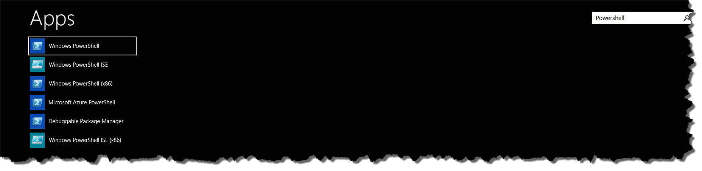

# Powershell (installation / configuration) for Magic Xpa RIA
The Magic Xpa RIA Builder which allows you to deploy a Magic RIA application to various platforms does this by running powershell scripts. This requires you to have powershell installed (actually not an issue because it ships with Windows). You do however also have to make it accessible for Magic Xpa by adding its installation path to system PATH environment variable because Magic XPA will simply invoke it from commandline with "powershell.exe" and has no option to configure it as an external tool.  

If you open a command prompt and type "powershell" and Windows does not find it you need to add powershell to the system PATH. For that you need to know where its actually installed and for that you can use powershell (there should be a link somewhere in your programs) or (like me) an integrated powershell in your favorite editor. Powershell variables $PSVersionTable and $PSHome give you the information you need: 

From above you know that it's Powershell v4 what you have and that its installed in C:\Windows\System32\WindowsPowerShell\v1.0 . C:\Windows\System32\WindowsPowerShell\v1.0 you need to add to your PATH in order to get "powershell" command work and that's what you need to get it working for Magic Xpa too.  

How to alter PATH is not covered here, just google for that.  

Note: On Windows Vista or later you would just type "powershell" and then look into the properties of what Windows found in order to get the installation path. That would also reveal alternative installations and additional tools, like the powershell IDE which is nice if you do a lot with it.

Also note: Default Magic XPA installation is to "Program Files (x86)" directory with the "Run as admin" flag for Studio and Runtime set. This has implications on all processes you or (Magic XPA automatically) start from inside Magic Xpa. Consider an installation of Magic XPA to a directory where it does not need "Run as admin" and elevation - like "c:\magic\xpa". Also be careful with installations to places where the path contains a space character. There's tools which will run into issues then.
