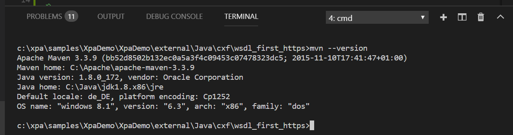

# SOAP requests with client certificates
This sample was created in the "TLS 1.2" context. Magic Xpa 3.3a allows Https secured by TLS 1.2, and that's required for many servers already and more from 30.06.2018 on, client certificates are however not yet supported by the Http frameworks "Java" and ".NET" which have been added to Magic Xpa 3.3 resp. Xpa 3.3a. 

This sample contains: 
1. A SOAP server which does require authentication with a client certificate, implemented with Apache CXF and Spring framework 
2. A .NET Framework class library which implements a Http POST with client certificates
3. A SOAP UI project for testing the SOAP server
4. Magic programs for testing the SOAP server

## Required Softare
### Maven
Apache Maven is used to build the Java samples (clients + server) and to execute/install them. You should download Maven from https://maven.apache.org/ and follow the installation instructions. If Maven is installed and configured correctly on your system you can type "mvn --version" from a command prompt and receive following (version dependent) output: 

## Running the sample (SOAP) server

## Optional software
| Name | Content |
| --- | --- |
| [Apache CXF](http://cxf.apache.org/) | Open source services framework for SOAP, XML/HTTP, RESTful HTTP and CORBA over HTTP, JMS or JBI |
| [KeyStore Explorer](http://keystore-explorer.org/) | Open Source GUI replacement for the Java commandline utilities which helps with the Java keystore files and certificates |
| [SoapUI](https://www.soapui.org/downloads/soapui.html) | Api Testing Tool (SOAP, RETful, ...) |
