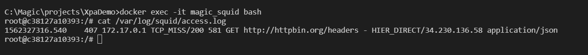

# Magic on Windows with Squid proxy
In of the recent discussions in magicu-l regarding Magic Http functions & support for later TLS versions we recommended to mitigate the issues by working with a proxy. Here is a brief description to install/configure such an environment, in order to be able to test this approach. 


## Requirements
Its the XpaDemo project so we are only able to test / demo this with Magic Xpa Single User which is basically a crippled Magic Xpa 3.3 for Windows from around 02/2018. 

Further requirements :
+ Windows 10 with Docker for Windows installed
+ (optional) Windows Subsystem for Linux activated and a Liux installed inside there

---

With above components available it should then be easy to get a test environment up & running.  

1.) Start Squid (a pretty popular proxy) by tying following in a command prmpt: 
```cmd
docker run -p 3128:3128 datadog/squid
```
This will download you a container image with Squid preinstalled. The proxy is configured to listen on its default port 3128 for HTTP/HTTPS connections and because of the port mapping we can talk to squid on port 3128, from any machine in the newtwork which can reach this host. 

You can check if the container is up and running with docker ps 


2.) Configure your Magic.ini for http proxy
Add following setting to your Magic.ini 
```cmd
[MAGIC_ENV]
HTTPProxyAddress = 127.0.0.1:3128
``` 
 
Alternatively you can use the Studio (Settings/Environment) to specify the proxies address, or even only put it on command line of a Shortcut. 
This will tell Magic not to directly connect to to any host in the Internet. More information about Magic & Proxy Settings can be found here: http://kb.magicsoftware.com/articles/bl_Reference/HTTP-Proxy---Address-Port-xpa 

3.) Thats it already :) 

If you do a HttpGet/HttpPost or invoke a webservice with Invoke Web S / Web S Lite, Magic will never try to connect directly to there but will send it's request to localhost:3128 instead and ask the proxy to connect to there and get a response and thats eactly what we need because we now basically "intercepted" the connection and can (typically by configuration) change what we want to change (like bumping up the SSL/TLS version, securing an originally unsecure request, ...). Next to that we get excellent options for logging, debugging and monitoring, ... . All that would however be "advanced" topics which does require us to configure squid a bit.  

For now you can simply write yourself a small test-program with your Magic version, which does an http/https request or use some of the Http demos in XpaDemo project like [OWCLN001](./Mitigate_Magic_TLS_Issues.md) 

In a future refinement of this document we'll show how to add monitoring to the proxy installation and how to persist the logfiles to your Windows filesystem with docker volumes. For now, when you want to check if a Http request did actually go via the proxy, you can use docker exec and a bash in the container to check the logs: 
 


