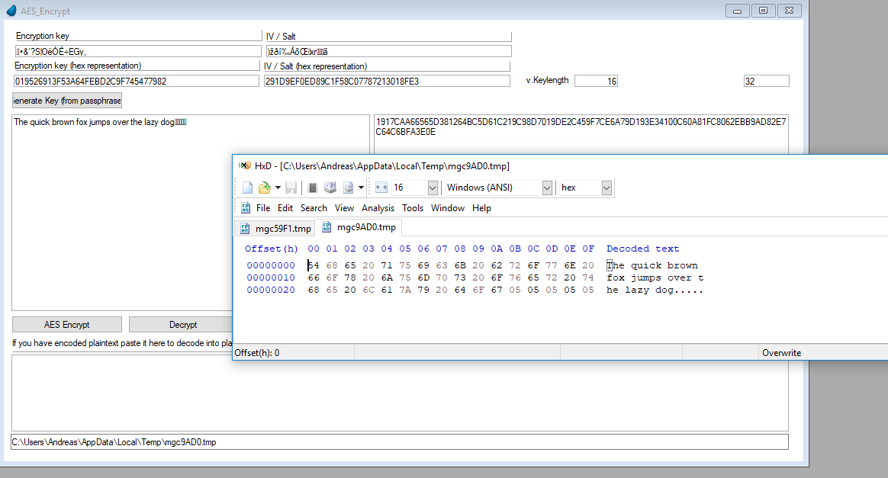

# Padding in XpaTCrypt / mgcrypt.dll

Block cipher modes for symmetric-key encryption algorithms (ECB, CBC, ...) require that the input length (plaintext) is a multiple of the blocksize. Does the message length differ from this requirement it has to be "padded" to get it to that length. Unfortunately there is not really a clear standard for this and different implementations of a block cipher may differ in the way they pad the plaintext.

XpaTCrypt resp. mgcrypt.dll uses Crypto++ 7.0 library where PKCS#7 padding is the default padding scheme for blockciphers. It would support different padding schemes as well, there's currently however no way to configure this in XpaTCrypt (or a parameter / option in mgcrypt.dll). If you need to support a different padding scheme (like the one from Magic Cipher() function which always pads messages with 0 Bytes) you currently need to pad the plaintext before encryption yourself.  

If two implementations of AES ECB/CBC encryption use different padding schemes it is likely that one does not remove the padding bytes of the other implementation. You will note that in example TSTO002_AES_Encrypt when you encrypt plaintext with mgcrypt.dll (program: XpaTCrypt.AES_Encrypt) and decrypt the ciphertext with Magic's Decipher() function (program: XpatCrypt.AES_Encrypt_MagicDecipher). mgcrypt.mgcrypt_AES_Encrypt padded the plaintext conforming to PKCS#7, Magic expects padding with null Bytes. On the screen you will see that the plaintext (after decryption) ends with some special characters, that's the PKCS#7 pad bytes:  

