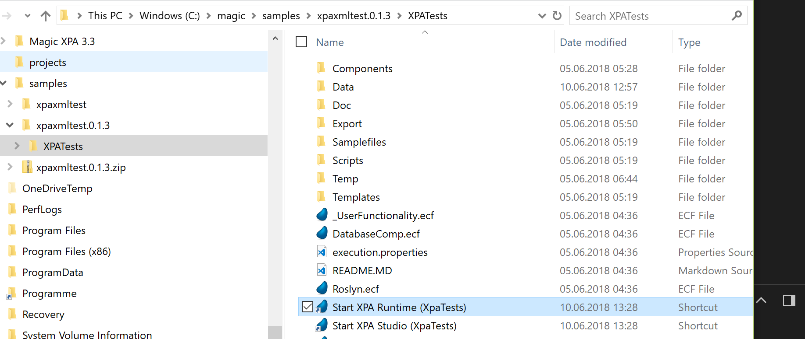

# Installing and running XpaDemo project from a release
This is about installing and running the XpaDemo project(s) from a release, which is what you should start with because, if you clone the git repository or download the zipped sources, you end up with something which won't run because the binaries need to be compiled first, they are not part of a source distribution. Following is a walkthrough to get such a release working.

The released versions of the XpaDemo project(s) you find on github too: 
https://github.com/asedl/xpaxmltest/releases 

# Download and unzip the release
The releases are PKZIP archives at the moment. Download the latest version and unzip to a new directory like c:\magic\xpa\samples\xpademo-0.1.3 

# Create a shortcut to Magic XPA Runtime
In the folder where XpaTests.ecf reside create a new shortcut to your Magic XPA 3.3 (or higher) Runtime and add the XpaTests.ecf as parameter for /StartApplication. The commandline of your shortcut would then look like following: 
"c:\Program Files (x86)\MSE\Magic XPA 3.3\MgXpaRuntime.exe" /StartApplication=c:\magic\xpa\samples\xpademo-0.1.3\XpaTests\XpaTests.ecf" 

You can also use MgXpaSettings.exe from your XPA installation to modify the StartApplication. 

You can also do this from command line. For that open a command prompt (cmd.exe) and type the command which will start your Magic XPA runtime with XpaTests.ecf opened:
"c:\Program Files (x86)\MSE\Magic XPA 3.3\MgXpaRuntime.exe" /StartApplication=c:\magic\xpa\samples\xpademo-0.1.3\XpaTests\XpaTests.ecf" 

# Review and persist configuration
When you did above the Magic XPA Runtime will start and will have the main component (application) of the XpaDemo project loaded, an .ecf named "XpaTests.ecf". This component will recognize that it's started the first time resp. that the configuration is not yet done (or broken) and come up with following configuration screen:
 

If everything went fine you should see the content of a Magic Xpa @Ini (Merge INI) there which can be used to start XpaTests.ecf with the required .INI settings (database definitions, logical names, ...). If you click "Create Shortcuts and Exit" the configuration program will write that .INI to disk and will also create you two shortcuts which you can use to start Studio and Runtime correctly configured for the XpaDemo project(s): 
 

_Note: The shortcut to Studio won't work yet because its configured to load the project file of the Demo project. That we do however not have yet because that's part of a source distribution and excluded from releases. You get the sources by cloning the github repository or by downloading it from there as a PKZIP archive_ 

Basically that's it. When you double click now the shortcut named "Start XPA Runtime (XpaTests)", your Magic XPA Runtime engine should start with the demo application loaded and, because the installation/configuration is valid now, skip the configuration screen and display the menu system. 

You can now download the sources of the Demo project(s) or clone the git repository in order to check how this is implemented or adding your own stuff, ... 

