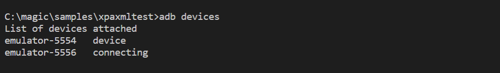

# Android Debug Bridge (adb)
adb.exe is a command-line utility which allows you to communicate with (Android) devices (can be emulators). It's needed to deploy Magic Xpa RC / RIA to Android devices and it's used for testing and debugging. Check the [Android devloper pages](https://developer.android.com/studio/command-line/adb) for more informations. adb.exe (the Windows version) ships with Android SDK where you will find it in the platform-tools folder of your SDK. Magic Xpa ships with an adb.exe too, there you will find it in the folder RIAModules\Utils\adb folder of your Magic XPA (Studio) installation.  

You can use the general adb command version to get version information: 
 

If you have your Android platform-tools in your path you can use it from command line without specifying it's location: 
 

If you have emulator(s) running, f.i. by starting one from Tools/AVD Manager in Android Studio, you can use adb command devices to get a list of those: 

# adb version conflict
When you start a device it will start a adb server and the adb client (adb.exe) will then connect to it. Versions of server and client should match, otherwise you get following: 
 
This is because the emulators were started from (latest) Android SDK and the client was from Magic Xpa installation which ships with an older version. Probably its best if you replace the adb files in your Magic installation with those from the platform-tools. I cant tell if you run into issues when server and client versions of adb do not match. 

