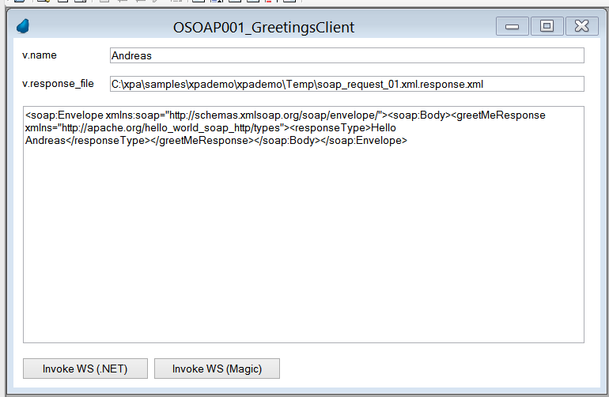

# OSOAP001_GreetingsClient

OSOAP001_GreetingsClient is an online program which does implement a UI for testing SOAP requests to a "GreetingsServer" (SOAP) webservice. OSOAP001_GreetingsClient is implemented in component [XpaTSoap](/XpaDemo/Doc/Components/XpaTSoap).

## Screen
 

In above screen the user left everything default and clicked one of the "Invoke WS" buttons, which sends a SOAP request to an "GreetingsServer" which did respond with the XML loaded into field "SOAP Response". 

## Buttons
### Invoke WS (.NET)
Calls program [BSOAP001_GreetingsClient](BSOAP001_GreetingsClient.md) with v.Name as a parameter[BSOAP001_GreetingsClient](BSOAP001_GreetingsClient.md) will generate a SOAP request with client certificates and send that to "GreetingsServer" via (.NET) XpaTHttpDNet.Post(). If that function succeds it will write the SOAP reponse (XML) to disk and return the location of that file in a parameter. OSOAP001_GreetingsClient then loads the content of this file into field SOAP_Response.

### Invoke WS (Magic)
Generates a SOAP request and sends that to "GreetingsServer". Implementation is part of OSOAP001_GreetingsClient and based on Magic "Invoke SOAP Lite". Currently this will always fail because no client certificates will be sent and "GreetingsServer" will not accept the connection therefore.

# Furter Notes / implementation details
The "GreetingsServer" (SOAP) webservice is implemented with Apache CXF and Spring framework. Actually it's one of the samples which do ship with Apache CXF, if you download that. Sources are copied to this project (-> /XpaDemo/external/Java/wsdl_first_https) 

