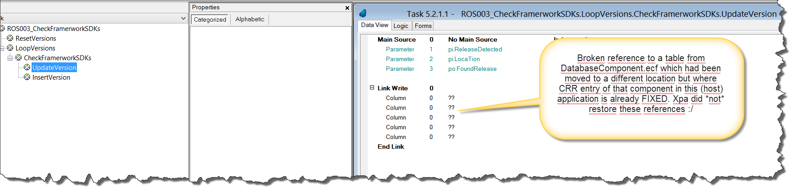
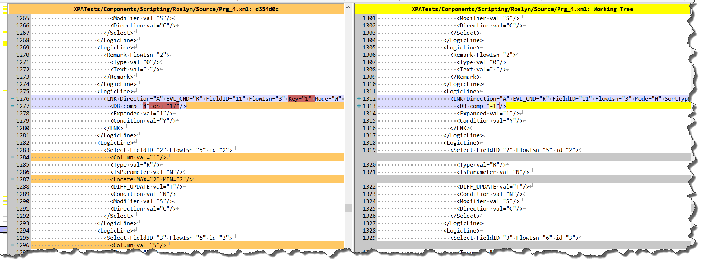

# "dependency hell" caused by Magic components

"Dependency hell" is a term many programmers might still be very familiar with and with today's development tools, frameworks and package management systems it became a lot better - when you compare it, with what you did have to fight with when you did C/C++ programming on MS Windows - lets say 20 years ago. With Magic itself (disregarding any external stuff you add like Java/.NET components) you should not run into much of these issues but there is and therefore this document.  

# XPA Components

The issues you do possibly experience with components do not really result in "dependency hell nightmare" but there are some and, f.i. when I started with this demo project/framework, which relies heavily on XPA components did run into quite some issues.

## Moving components

At a point of time I decided to move all my components from root directory %XPATEST_HOME% where they were because they do then reside in same directory as host component and where %WorkingDir% points too and cause no issues when %XPATEST_HOME% is not (yet) set to %XPATEST_HOME%Components\ . I created a logical name pointing to that component and used that for the location of the .ecf in .ecf property of .eci file - like in %Components%DatabaseComponent.ecf (expands to C:\xpa\samples\XpaDemos\XpaRest\Components\DatabaseComponent.ecf). Afterwards I fixed the (now invalid) references in CRR of XpaTest.edp (from DatabaseComponent.ecf to %Components%DatabaseComponent.ecf) and did get following:
1. As expected - a crash when running one of the programs in Components\Roslyn.ecf because that has a reference to DatabaseComponent.ecf in CRR too and that became invalid because I moved the component away. Not a big issue I thought - lets just fix it by correcting DatabaseComponent.ecf in CRR to %Component%DatabaseComponent.ecf and Magic will fix the references in programs (like models and database indexes). Result: **It did not, references where gone** and I had to fix them manually which is not an easy task because if you see "datasource: 0, column: 0" you need to remember what it actually was.  Reload ing the component from .eci btw. did not change that.

This is behaviour which I saw a lot in v9 and where I thought it became finally fixed in uniPaaS 1.5/1.9 or so because from then on it did not happen anymore. It seems back and it's not yet clear to me if its a "Single User" issue. Its only clear to me that it's a nightmare for "Single User" because it has no team development.

Now (completely broken) Roslyn.ecf only has a few programs. Still I decided to revert to an old version from Git repository - I effectively lost some work and some time and thats only one component.  

Here is the look into the source view. On the left side, latest version from repository, on the right side the broken version from local file system:  
  

A "checker" program can find out that this table is broken, all indication what the original table could have been are gone however, Magic removed the refences to the component table COMPLETELY from this program, no way for a program to "heal" this - besides comparing with an old version - which is not guaranteed to work.
 
Only good news is: XpaTPomo (xpa-project-scan) already has some faetures which help to detect and fix some of the issues with components and it is planned to add functionality which fixes such a broken component automatically - if its possible because Magic did leave some trace of the references it deleted in a project file. Second best (or at least helpful to some extend) would be to compare the component with an old version from git history - in case you do realize broken component references late and do not want to revert to an old version because you did change already a lot, ...  . That should be however not the case because these checks from xpa-project-scan run automatically and frequently on your sources - empowered by Jenkins. SonarLint for XPA ... at the end.

_MSE btw. never confirmed that bug and I suffered a lot from it in a v9 application which basically had only ONE component. Now this bug seems back - unless I did something wrong but I dont think so._

I _think_ the issue could be that (after moving the components) I did go thru all .edps of the components, fixed the references to XPA components in CRR and created a new .ecf + new .eci because I had the project open anyways. Maybe this is when Xpa looses the reference which it cannot restore then later ?

